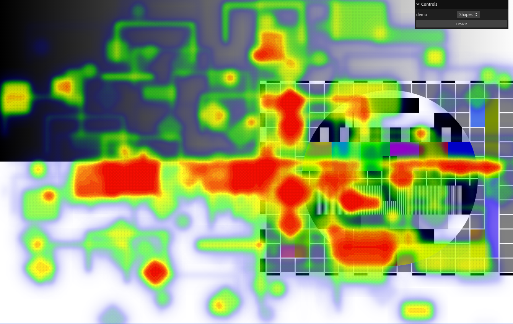

# heatmap-renderer

Implementation inspired by [heatmap.js](https://github.com/pa7/heatmap.js).

This library allows you to render a list of shapes as a heatmap using webgl.

__Note__ this is still somewhat wip.

## Basic setup

```ts
const heatmap = new Heatmap(wrapperElement, {
    max: 10
});
registerDefaultShapes(heatmap);
heatmap.render([
    { radius: 20, type: ShapeType.circle, x: 10, y: 10, value: 10 }
]);
```

## Monorepo

- `heatmap-renderer` - package source
- `heatmap-renrerer-examples` - project with various usage examples
  Uses [PM5544 Test card](https://en.wikipedia.org/wiki/Test_card#/media/File:Philips_PM5544.svg)

## Running



- `yarn workspace heatmap-renderer-examples start` to start the example project